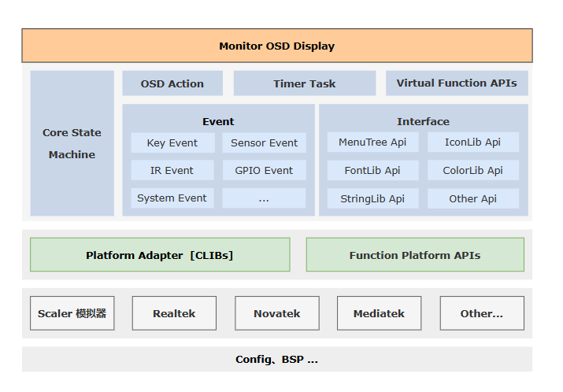

## 工具简介

- MUI工具是一个用于设计和开发显示器OSD菜单的工具，使用CVTE域账号登录、包含MENU和LOGO两种设计模式、UI设计器界面、UI模拟器、图片编辑器、字库编辑器和开发助手等基本功能。
- UI设计器界面提供了菜单设计、条目设计、布局设计和设计预览等功能，可对当前菜单进行新增、删除、编辑和位置尺寸调整等操作。
- UI模拟器界面提供了对UI代码的模拟运行，提供不依赖实体平台快速开发和Debug OSD界面的能力
- 图片编辑器和字库编辑器则分别处理在OSD中显示的Icon图标和翻译表字符串及点阵字库。
- 如果您在使用MUI工具时遇到问题，请参考MUI开发文档或联系开发人员。

## 资源获取
- 工具下载链接：[https://drive.cvte.com/p/DTtFbmkQxfsBGP6jHQ](https://drive.cvte.com/p/DTtFbmkQxfsBGP6jHQ)
- 运行环境：[https://drive.cvte.com/p/DXMSKokQyq8BGJvcGw](https://drive.cvte.com/p/DXMSKokQyq8BGJvcGw) (.NET6.0 x86 桌面运行时)

## 开发指南
* [MUI 字库编辑器](pages/FontEditor/index.md)
* [MUI 图片编辑器](pages/ImageEditor/index.md)
* [MUI 设计器](pages/Designer/index.md)
* [MUI 模拟器](pages/Simulator/index.md)
* [开发流程及规范](pages/Develop/index.md)
* [常见问题及处理](pages/FAQ/index.md)

## 快速开始