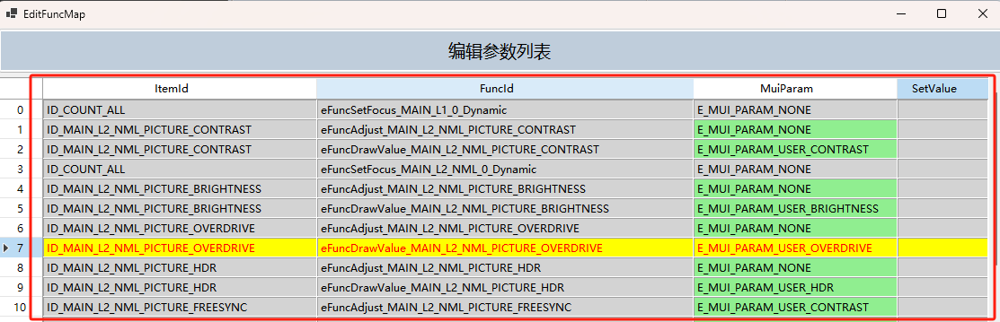
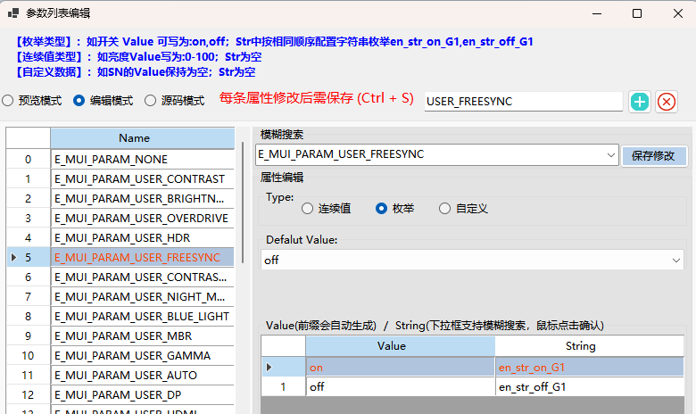

# 参数映射设计指南



## 基本介绍
参数映射用于实现OSD功能与调节参数的关联，实现功能枚举、条目ID、参数枚举、字符串枚举之间的关系映射及定义，并提供相关操作API。
- 参数映射生成的资源代码位于：`osd_resource/CRes_MUI_FunctionMap_c.inl`
- 提供如下API，方便页面逻辑代码调用
    ```c
    // 获取指定功能绑定的参数类型
    extern EnumMuiParam CApi_FuncMap_GetFuncParam(EnumFuncAction eFunc);
    // 获取指定功能绑定的菜单项
    extern EnumMenuItem CApi_FuncMap_GetFuncItem(EnumFuncAction eFunc);
    // 获取指定 FuncExec_XXX 函数绑定的执行值
    extern EnumMuiValue CApi_FuncMap_GetFuncExecValue(EnumFuncAction eFunc);
    // 获取指定条目绑定的值(注意：此处是由eFuncExec功能绑定的value)
    extern EnumMuiValue CApi_FuncMap_GetItemBoundValue(EnumMenuItem eItem);
    // 获取指定条目绑定的参数
    extern EnumMuiParam CApi_FuncMap_GetItemBoundParam(EnumMenuItem eItem);
    // 获取参数类型(枚举型、连续值类型、用户定义)
    extern EnumParamType CApi_FuncMap_GetParamType(EnumMuiParam eParam);
    // 获取参数数量
    extern unsigned char CApi_FuncMap_GetParamCount(EnumMuiParam eParam);
    // 获取参数最小值(枚举型返回最小枚举值，连续值类型返回最小值，用户定义类型返回0)
    extern unsigned short CApi_FuncMap_GetParamMin(EnumMuiParam eParam);
    // 获取参数最大值(枚举型返回最大枚举值，连续值类型返回最大值，用户定义类型返回0)
    extern unsigned short CApi_FuncMap_GetParamMax(EnumMuiParam eParam);
    // 获取参数枚举值索引（适用于枚举值类型）
    extern unsigned char CApi_FuncMap_GetParamEnumValueIdx(EnumMuiParam eParam, EnumMuiValue eValue);
    // 获取参数第 idx 个枚举值（适用于枚举值类型）
    extern EnumMuiValue CApi_FuncMap_GetParamEnumValue(EnumMuiParam eParam, unsigned char idx);
    // 获取参数枚举值对应的字符串索引
    extern EnumStringIdx CApi_FuncMap_GetParamEnumString(EnumMuiParam eParam,  EnumMuiValue eCurValue);
    // Mui标准值映射到platform值
    extern unsigned short CApi_FuncMap_Mui2VfpValue(EnumMuiParam eParam, EnumMuiValue eCurValue);
    // platform值映射到Mui标准值
    extern EnumMuiValue CApi_FuncMap_Vfp2MuiValue(EnumMuiParam eParam, unsigned short usValPlat);
    // 获取下一个参数枚举值
    extern EnumMuiValue CApp_FuncMap_GetParamNextEnumValue(EnumMuiParam eParam, EnumMuiValue eCurValue);
    // 获取上一个参数枚举值
    extern EnumMuiValue CApp_FuncMap_GetParamPrevEnumValue(EnumMuiParam eParam, EnumMuiValue eCurValue);
    ```

## 为什么要进行参数映射

1. 减少重复代码量，统一维护映射表及转换函数
    !!!
    - 学习了MUI的条目设计之后，我们知道所有的OSD功能响应是通过：`FuncSetFocus_xxx`、`FuncDrawValue_xxx`、`FuncExec_xxx`、`FuncAdjust_xxx` 四个功能函数来完成的

    - 这四个函数均传递 `EnumFuncAction` 功能枚举参数，如果没有参数映射，每个功能实际要调节/调用哪一个参数变量，每个变量值跟OSD条目或字符串显示之间的关联关系都需要自己在页面逻辑中指定，会引入大量的条件选择代码

    - **参数映射模块将所有的参数与功能关联起来，统一提供功能枚举、条目ID、参数枚举、字符串枚举之间的关系映射的API转换函数**
    !!!
2. 定义统一的**MUI参数枚举**、**MUI标准值枚举**；是MUI能够脱离平台代码在模拟器上运行的基础
    !!!
    - MUI参数枚举：统一的参数枚举值 `E_MUI_PARAM_XXX`
    - MUI标准值枚举：参数的统一标准值 `en_value_xxx`
    !!!
3. 定义统一的**MUI标准值枚举** 与 **实际平台值** 的转换API
    !!!
    - 整个 MUI 页面逻辑全部基于 **MUI标准值枚举** 运行，即MUI页面逻辑与平台代码解耦合
    - 各方案实际功能响应时、数据存储时，需要将 **MUI标准值枚举** 与 **实际平台值** 互转
    - 上述操作统一通过`CApi_FuncMap_Mui2VfpValue` 与 `CApi_FuncMap_Vfp2MuiValue`函数进行
    !!!

## 如何设计及使用参数映射
1. 首先在参数列表中添加相关的参数定义（用于生成MUI参数枚举和MUI标准值枚举）
2. 在参数映射界面为需要的条目及功能添加参数映射关系
3. 在OSD功能响应代码中通过 `CApp_FuncMap_xxx` API 获取并转换相关信息，使用示例代码如下：
    ```c
    /*示例一: 在 FuncAdjust_MAIN 页面功能响应函数中使用参数映射API */
    void FuncAdjust_MAIN(EnumFuncAction eFunc, MUI_BOOL bInc)
    {
        // 查询当前功能调节的参数
        EnumMuiParam eParam = CApi_FuncMap_GetFuncParam(eFunc);
        // 获取当前参数的值
        unsigned short usValue = CApp_MUI_VF_GetValue(eParam);
        // 执行功能调节响应
        switch (eFunc)
        {
            case eFuncAdjust_MAIN_OSD_TIMEOUT_ADJ:// OSD 显示时间调节，特殊步进值，单独处理
                CApp_MUI_VF_SetValue(eParam, (bInc) ? usValue + 5 : (usValue <= 0) ? usValue : usValue - 5, MUI_TRUE);
                break;
            default:
                CApp_MUI_VF_SetValue(eParam, (bInc) ? usValue + 1 : (usValue <= 0) ? usValue : usValue - 1, MUI_TRUE);
                break;
        }
    }

    /*示例二: 在 FuncExec_MAIN 页面功能响应函数中使用参数映射API */
    void FuncExec_MAIN(EnumFuncAction eFunc)
    {
        // 查询当前功能调节的参数
        EnumMuiParam eParam = CApi_FuncMap_GetFuncParam(eFunc);
        // 获取当前条目绑定的参数值
        unsigned short usValue = CApi_FuncMap_GetFuncExecValue(eFunc);

        switch (eFunc)
        {
            // 特殊功能响应
            case eFuncExec_MAIN_SUB_FACTORY:
                CApp_MUI_ACT_StartupOSD(E_MENU_FACTORY);
                break;
            case eFuncExec_MAIN_INFORMATION_RESET_ALL_SETTINGS:
                CApp_MUI_ACT_StartupOSD(E_MENU_INFORMATION);
                break;
            case eFuncExec_MAIN_COLOR_6_AXISHUE_RESET:
                SET_CUR_ITEM_ID(ID_INFORMATION_RESET_OK_6AXIS);
                CApp_MUI_ACT_StartupOSD(E_MENU_INFORMATION);
                break;
            case eFuncExec_MAIN_OSD_LOCK_ON:
                CApp_MUI_VF_SetValue(eParam,usValue,MUI_TRUE);
                SET_CUR_ITEM_ID(ID_MESSAGE_OSD_LOCKED);
                CApp_MUI_ACT_StartupOSD(E_MENU_MESSAGE);
                break;
            // 执行默认响应
            default:
                if(CApp_MUI_VF_GetValue(eParam) != usValue) {
                    CApp_MUI_VF_SetValue(eParam, usValue, MUI_TRUE);
                }
                break;
        }
    }
    ```