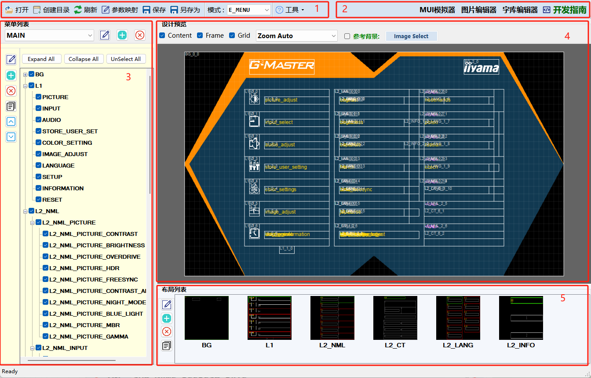

# MUI 设计器

## 模块简介
=== **工具栏**（1）
- [!badge variant="ghost" text="打开"]：打开一个*.mui工程文件
- [!badge variant="ghost" text="创建目录"]：创建一个新的mui工程文件及其目录结构
- [!badge variant="ghost" text="刷新"]：刷新当前工程的资源，添加或删除翻译或图片资源后需要刷新
- [!badge variant="ghost" text="保存"]：保存当前工程，同时生成c语言代码
- [!badge variant="ghost" text="另存为"]：导出当前工程为新的*.mui工程文件
- [!badge variant="ghost" text="参数映射"]：编辑当前工程的条目与参数值的映射关系
- [!badge variant="ghost" text="模式"]：选择当前的设计模式（E_MENU/E_LOGO）, 菜单模式和Logo模式主要是生成目录与c语言代码文件的区别
- [!badge variant="ghost" text="工具"]：包含了常用链接，检查更新等功能

=== **功能栏**（2）
- [!badge variant="ghost" text="MUI模拟器"]：打开MUI模拟器
- [!badge variant="ghost" text="图片编辑器"]：打开图片资源编辑器
- [!badge variant="ghost" text="字库编辑器"]：打开字库资源编辑器
- [!badge variant="ghost" text="开发指南"]：打开开发指南文档

=== **[菜单设计](menu.md)**（3）
- [!badge variant="ghost" text="菜单编辑"]：管理菜单页面，编辑（画布尺寸、位置、及命名等）、添加、删除菜单页面等
- [!badge variant="ghost" text="条目编辑"]：条目属性编辑

=== **设计预览**（4）
- [!badge variant="ghost" text="Content"]： 是否预览菜单页面内容
- [!badge variant="ghost" text="Frame"]：是否预览菜单布局框架
- [!badge variant="ghost" text="Font"]：是否预览菜单页面Font网格
- [!badge variant="ghost" text="Zoom"]：预览菜单页面的缩放比例，默认Auto
- [!badge variant="ghost" text="参考背景"]：启用参考背景，将OSD设计图作为背景，用于布局位置参考，点击 [!badge variant="ghost" text="ImageSelect" size="xs"] 选择图片

=== **[布局设计](layout.md)**（5）
- [!badge variant="ghost" text="布局编辑"]：管理菜单布局，编辑（布局名称、布局类型、布局大小、布局位置等）、添加、删除布局等

===