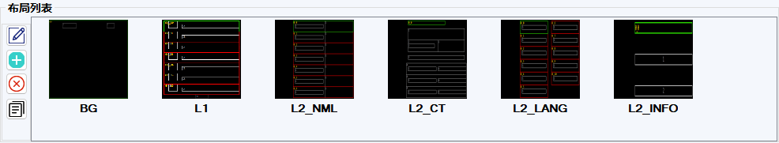
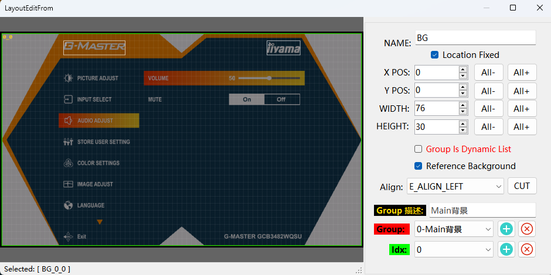

# MUI 菜单页面布局设计指南

### 页面名词解释
- [!badge variant="ghost" text="**布局**"]：为OSD条目内容提供绘制位置信息，包括**起始坐标、宽高及分组**情况等信息。

- [!badge variant="ghost" text="**NAME**"]：布局名称，此名称将菜单列表的根节点，此布局下的所有条目都将挂在此根节点下
- [!badge variant="ghost" text="**布局组（Group）**"]：条目中同一类内容的位置信息分在同一个布局组中；例如：一个条目根据需要通常由图片组、字符串组、Focus组等几个布局组来描述定义。
- [!badge variant="ghost" text="**固定位置（Location Fixed）**"]：当前布局所有位置的起始坐标是否固定，如果不固定则可以通过代码Api设定XY偏移，主要用于绘制包含条目跟随弹窗的菜单界面。
- [!badge variant="ghost" text="**对齐方式（Align）**"]：主要指字符串or图片在选中布局位置内的水平对齐方式（左/中/右）
- [!badge variant="ghost" text="**布局组描述（Group 描述）**"]：用于描述当前布局组的功能作用，在条目属性编辑时可以通过此描述来快速选择需要的布局组，
条目属性中选择布局组时会以 `en_pos_XXX_XXX_XXX（Group 描述）`呈现。
- [!badge variant="ghost" text="**布局索引（Idx）**"]：主要用于动态列表组中重复性的布局信息，用于一个布局组中的位置索引。例如：某级菜单中每一页需显示5个条目，则定义Idx0~4，用于定义这5个条目的位置关系。
- [!badge variant="ghost" text="**动态列表组（Group is Dynamic List）**"]：具有可导航属性的条目显示位置多数通过动态列表组来描述，动态列表组中包含Idx0-IdxN，用于描述动态列表中每一项的位置信息。
勾选动态列表组后，Layout 列表中 Idx0-IdxN 后缀将自动隐藏，条目属性中选择布局组时 会以 `en_pos_XXX_XXX_Dynamic` 的名称呈现。
- [!badge variant="ghost" text="**参考背景（Reference Background）**"]：使能参考背景，用于快速定义布局位置（需要设计器预览界面先加载参考背景图）

### 布局拆分规则(*重要)
通过布局列表我们发现一个菜单页面由多个布局组成，例如 BG（背景）、L1（一级菜单）、L2 (二级菜单) 等，如何将菜单页面拆分为多个布局？
可参考如下分配规则：
1. 【动静分离】
    + 显示/刷新固定内容的位置通常我们定义为 BG 布局；用于定义菜单页面主背景图片、页面Logo、按键导航提示、菜单状态提示等布局组。
    + 显示/刷新动态内容的位置通常我们定义为 ITEM 或 L(n) 布局；用于定义页面各级动态刷新的菜单。
2. 【减少重叠】
    + 同一个布局中的多个布局组尽量减少重叠，方便后续维护快速定位到需要修改的布局。
    + 对于简单的动态布局，通常将所有动态布局放在同一个布局中，例如：一级菜单、二级菜单、等都定义在一个 ITEM 布局中。
    + 对于复杂的动态布局，同一级菜单布局结构可能无法共用，通常将动态布局分为多个布局，例如：一级菜单、二级菜单language、二级菜单info、等分别定义在 L1、L2_LANG、L2_INFO 布局中。

**综合以上规则，通常一个菜单页面由两个布局构成成（一动一静），复杂的OSD界面可能存在多个动态布局（例如操作复杂的主OSD界面），简单的OSD界面可能仅存在一个静态布局（例如提示框菜单）。**

### 创建一个布局
1. 点击布局列表左侧菜单按钮，选择，创建一个新的界面
2. 编辑布局页面信息，NAME、XY位置、宽高、对齐方式、布局组定义，布局组描述等内容
3. 关闭布局编辑界面后即可创建一个新的布局