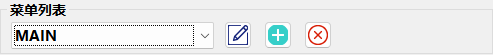
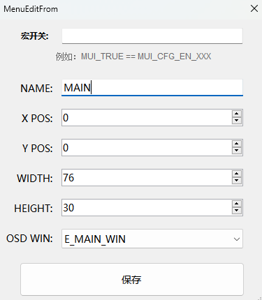

# MUI 菜单页面画布定义

### 页面名词解释
- [!badge variant="ghost" text="**宏开关**"]：用于当前菜单页面的资源条件编译控制

- [!badge variant="ghost" text="**NAME**"]：菜单页面名称，用于在菜单列表中显示及条目命名前缀；例如：MAIN、INPUT、FACTORY等
- [!badge variant="ghost" text="**X/Y POS**"]：菜单页面在屏幕中的相对位置，单位为 **像素**，如果OSD位置可调，此项可忽略，由代码自定义
- [!badge variant="ghost" text="**WIDTH/HEIGHT**"]：菜单页面在屏幕中的宽高，单位为 **FONT(12x18像素)**
- [!badge variant="ghost" text="**OSD_WIN**"]：菜单所处的物理 OSD ID，一般方案都会支持多个OSD用于支持多OSD页面同时显示（常见：如准星和游戏倒计时菜单）

### 创建一个OSD页面
1. 选择菜单按钮，创建一个新的界面
2. 编辑页面信息：NAME、位置、W/H（画布大小），选择OSD_WIN后保存即可创建一个新的页面