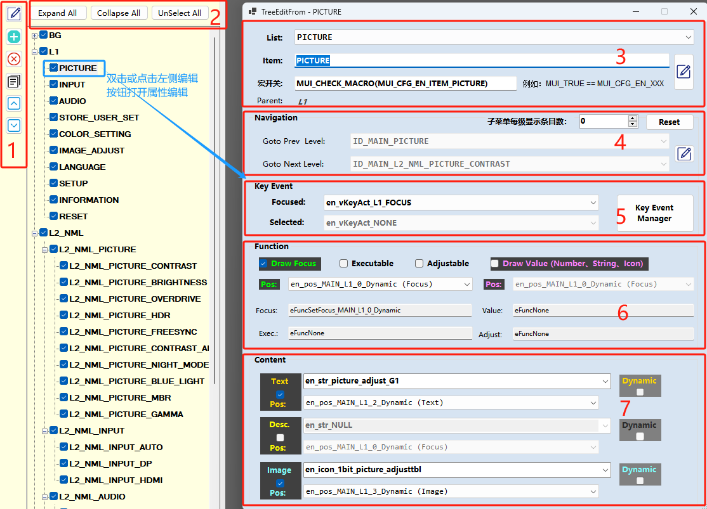
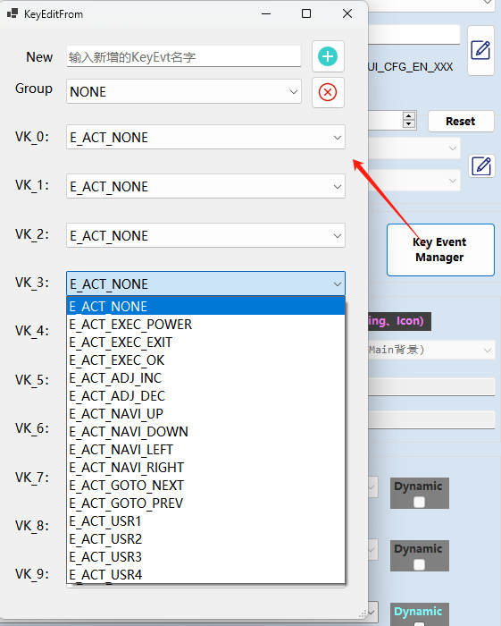
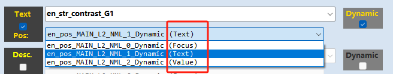

# MUI 菜单条目及其属性设计


## 界面及属性说明
=== **条目常用操作**（1）
- 提供当前菜单条目的 **新增、删除、编辑、复制、上下位置调整**功能
- 以布局为根节点进行条目的 **增删改**
=== **列表折叠及展开**（2）
- 菜单项列表的折叠与展开功能
- 菜单项列表根节点全部反选功能
=== **属性-基本信息**（3）
- [!badge variant="ghost" text="**List**"]：从当前菜单列表中选择一个条目进行编辑
- [!badge variant="ghost" text="**Item**"]：菜单项的名称ID，用于唯一标识一个条目;
- [!badge variant="ghost" text="**宏开关**"]：同菜单页面宏开关，用于当前条目的条件编译控制
- [!badge variant="ghost" text="**Parent**"]：当前条目的父节点，用于构建菜单树结构，工具自动根据父节点的ID生成
!!!warning 命名规则
- 条目ID命名规则：ID_`MenuName`_`ItemName`（自动全大写、同一个`Menu`下条目命名不允许重复）
- `MenuName` 菜单名称，尽可能使用一个简短的单词描述，如：`MAIN`、`NAVI`、`AIMPOINT`、`MODE`、`INPUT`、`FACTORY`、`HOTKEY` 等等
- `ItemName` 条目名称，需要能简短清晰表述当前条目的功能作用，一般建议使用两个单词组合，允许使用常见词汇缩写，如：`BACKLIGHT_ADJ`、`CONTRAST_ADJ`、 `INPUT_SEL` 等等
!!!
!!!warning 条目开关宏（非必要情况，请尽量避免使用任何宏）
- 条目开关宏仅在满足不同客户或机型需求时使用，需要在编辑框填写 `#if` 之后的内容
- 实际开关宏的定义及配置应在 `CApp_MUI_Config.h` 文件中
!!!
=== **属性-Navigation**（4）
- [!badge variant="ghost" text="**子菜单每级显示条目数**"]：限制当前条目的子级菜单列表在布局上的最大显示条数，默认0表示无限制
- [!badge variant="ghost" text="**Goto Prev Level**"]：导航到前一级菜单的条目ID
- [!badge variant="ghost" text="**Goto Next Level**"]：导航到后一级菜单的条目ID
- [!badge variant="ghost" text="**Reset**"]：重置当前菜单项前后级导航条目ID
!!!warning 注意
- 在按键ACT事件中会有`E_ACT_GOTO_NEXT`、`E_ACT_GOTO_PREV`事件，页面逻辑文件进行 KeyHandle 处理时可根据条目预定的前后级关系进行跳转
- 特殊情况下，前后级关系跳转可能与菜单需求相关（不使用默认值），例如：进入下级菜单时首先选中后一级菜单的特定条目，此时需要根据实际情况在 KeyHandle 时自行选择要跳转的条目
!!!
=== **属性-KeyEvent**（5）
- [!badge variant="ghost" text="**Focused**"]：当前条目处于 Focused 状态时所响应的按键事件组；例如：在当前条目上执行导航操作时的响应
- [!badge variant="ghost" text="**Selected**"]：当前条目处于 Selected 状态时所响应的按键事件组；例如：在当前条目上执行Adjust操作时的响应
- [!badge variant="ghost" text="**Key Event Manager**"]：按键事件组管理，将MUI虚拟按键 VK_x 映射为实际的 E_ACT_xxx 事件处理；

{width=400}
!!!warning 注意
- 编辑菜单条目前，应建立好按键事件组，用于配置所有条目的按键响应。
- 如下代码为按键事件在页面逻辑文件中的实现示例：
    ```c
    void CApp_MUI_ACT_HandleXxxMenuKey(EnumVirtualKey vKey)
    {
        EnumActionType eActType = E_ACT_NONE;
        EnumMenuItem eItem = GET_CUR_ITEM_ID();
        EnumMenuItem eAimItem = eItem;

        /* 根据条目状态判断响应事件组 */
        if(MUI_IS_SELECTED()) {
            eActType = CRes_MUI_GetSelectAction(eItem, vKey);
        }else{
            eActType = CRes_MUI_GetFocusAction(eItem, vKey);
        }

        /* 根据事件类型处理事件响应 */
        switch(eActType)
        {
            case E_ACT_NAVI_UP:   /*do something*/     break;
            case E_ACT_NAVI_DOWN: /*do something*/     break;
            // ...
            default: return;
        }
        /*刷新菜单等*/
    }
    ```
!!!
=== **属性-Function**（6）
在MUI中，每个条目功能响应分为四种类型，使能每种功能都会生成对应功能枚举，需要在MUI页面逻辑文件中实现对应的处理函数并完成对功能枚举的响应：
- [!badge variant="ghost" text="**Draw Focus**"]：绘制当前条目的焦点样式，`CApi_MUI_DrawItem` 传入 `E_FOCUS` 调用 `FuncSetFocus_xxx` 函数执行焦点样式绘制；绘制区域由`Pos`指定
- [!badge variant="ghost" text="**Draw Value**"]：绘制当前条目的值属性（Num、Str、Icon、自定义控件等），`CApi_MUI_DrawItem` 传入 `E_VALUE` 调用 `FuncDrawValue_xxx` 函数执行值绘制；绘制区域由`Pos`指定
- [!badge variant="ghost" text="**Executable**"]：执行当前条目的功能响应，统一由 `CApi_MUI_ExecItemFunc` 调用页面 `FuncExec_xxx` 函数执行功能响应；
- [!badge variant="ghost" text="**Adjustable**"]：调整当前条目的功能响应，统一由 `CApi_MUI_AdjustItemFunc` 调用页面 `FuncAdjust_xxx` 函数执行功能响应；
!!!warning 注意
- `FuncSetFocus_xxx`、`FuncDrawValue_xxx`、`FuncExec_xxx`、`FuncAdjust_xxx` 的`xxx`后缀表示菜单名
- 以下示例是 `CRes_MUI_Menu_h` 文件中由工具生成的函数声明，具体函数实现请自己在 `osd_action` 目录的页面逻辑文件中实现，如未定义则会造成编译链接失败！
    ```c
    /*================ FUNC STATEMENT ================*/
    //========MAIN_Func_h ========
    extern void FuncExec_MAIN(EnumFuncAction eFunc);
    extern void FuncAdjust_MAIN(EnumFuncAction eFunc, MUI_BOOL bInc);
    extern void FuncSetFocus_MAIN(EnumFuncAction eFunc, EnumMenuItem eItem, ST_MENU_LAYOUT * pLayout);
    extern void FuncDrawValue_MAIN(EnumFuncAction eFunc, ST_MENU_LAYOUT * pLayout);
    //========NAVI_Func_h ========
    extern void FuncExec_NAVI(EnumFuncAction eFunc);
    extern void FuncDrawValue_NAVI(EnumFuncAction eFunc, ST_MENU_LAYOUT * pLayout);
    //========AIMPOINT_REFRESHNUM_Func_h ========
    extern void FuncDrawValue_AIMPOINT_REFRESHNUM(EnumFuncAction eFunc, ST_MENU_LAYOUT * pLayout);
    //========MODE_Func_h ========
    extern void FuncExec_MODE(EnumFuncAction eFunc);
    extern void FuncSetFocus_MODE(EnumFuncAction eFunc, EnumMenuItem eItem, ST_MENU_LAYOUT * pLayout);
    ```
!!!
=== **属性-Content**（7）
- [!badge variant="ghost" text="**Text**"]：当前条目需要显示的字符串名称，`CApi_MUI_DrawItem` 传入 `E_TEXT` 调用 `CApi_MUI_ShowTableString` 函数显示字符串；绘制区域由`Pos`指定
- [!badge variant="ghost" text="**Desc**"]：当前条目的描述信息，`CApi_MUI_DrawItem` 传入 `E_DESC` 调用 `CApi_MUI_ShowTableString` 函数显示字符串；绘制区域由`Pos`指定
- [!badge variant="ghost" text="**Image**"]：当前条目的图标，`CApi_MUI_DrawItem` 传入 `E_IMAGE` 调用 `CApi_MUI_DrawImage` 函数显示图标；绘制区域由`Pos`指定
!!!warning Dynamic 属性说明
- 每个条目可能出于不同的需要，需切换不同状态下的显示内容，并非始终显示初始值；常见如：语言国家相关条目的状态图标，按键导航提示条目的字符串及图标都需要动态切换，相应的 `Content` 需使能 `Dynamic` 属性，由代码根据实际状态自定义 string、image；
- 以下 `CallBack` 函数定义定义在 `CApp_MUI_Action.c` 文件中，在绘制`Content`时，如果使能了 `Dynamic` 属性，则会调用 `CApi_MUI_CallBack_GetDymXXX` 函数来获取自定义内容；
返回值为`none`则使用工具定义的默认值；
    ```c
    //**************************************************************************
    // 外调接口定义
    //**************************************************************************
    extern EnumImageTbl   CApi_MUI_CallBack_GetDymImage(EnumMenuItem eItem); //获取自定义图标
    extern EnumStringIdx  CApi_MUI_CallBack_GetDymText(EnumMenuItem eItem);  //获取自定义字符串
    extern EnumStringIdx  CApi_MUI_CallBack_GetDymDesc(EnumMenuItem eItem);  //获取自定义描述字符串
    //**************************************************************************
    extern unsigned short CApi_MUI_CallBack_GetDymTextColor(EnumMenuItem eItem);//字符颜色
    extern unsigned short CApi_MUI_CallBack_GetDymDescColor(EnumMenuItem eItem);//描述颜色
    ```
!!!
===

## 操作技巧
### 菜单或条目重命名
!!!
工具中菜单或条目重命名无法关联到页面逻辑文件（.c/.h）中相关函数名、变量名、枚举名等名称的变更，会导致编译失败，菜单设计完成后请避免直接在工具中重命名！

条目重命名正确做法为使用代码编辑器对当前工程下所有文件进行批量搜索和替换，将所有相关名称进行统一修改，完成后重新打开 *.mui 工程文件，再进行菜单设计即可！
!!!

### 条目列表设计
!!!
同一级条目列表往往具有相似的功能及内容配置，因此建议先设计好一个条目作为模板，然后根据需要复制当前条目，并修改相关属性及内容配置即可！
!!!

### 布局组选择
!!!
绘制条目`Content/Focus/Value`时，需要选择合适的布局位置（`Pos`）,为了避免位置混淆和方便后期维护，强烈建议在布局设计时定义好布局组描述！
定义方法：详见 [布局设计-页面名词解释-布局组描述（Group 描述）](layout.md#页面名词解释)

下图括号中为布局组描述，这样我们就很清晰的知道当前内容需要绘制在哪个布局组中：


!!!