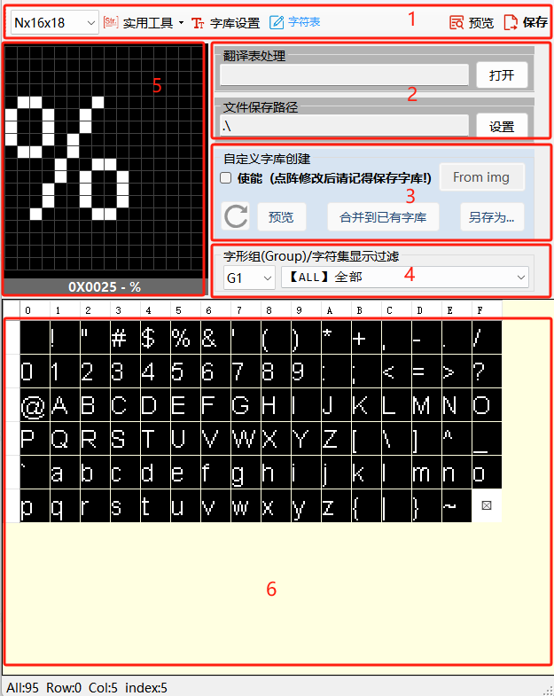
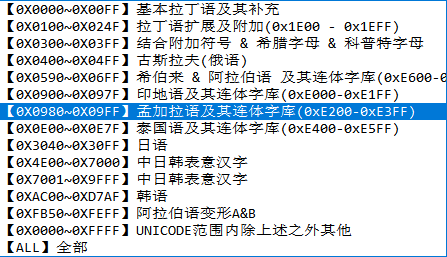

## 模块简介
=== **工具栏**（1）
- [!badge variant="ghost" text="字形"]：选择创建 `Nx16x18` 或 `12x18` 点阵字库。
- [!badge variant="ghost" text="实用工具"]：字符转图片、方案字库转换等实用小工具
- [!badge variant="ghost" text="字库设置"]：编辑字库配置，设置不同字符集所使用的字体信息
- [!badge variant="ghost" text="字符表"]：手动编辑/显示当前字符表
- [!badge variant="ghost" text="预览"]：预览当前字库代码
- [!badge variant="ghost" text="保存"]：将当前翻译及点阵字库保存为C文件
=== **翻译表加载**（2）
- [!badge variant="ghost" text="打开"]：加载一个翻译表（Excel文件），默认应放置在 `osd_resource\stringTable` 目录下
- [!badge variant="ghost" text="设置"]：设置生成代码路径，默认应为 `osd_resource` 目录
=== **字符集及字形组过滤器**（4）
- 仅用于过滤预览区显示的字符内容
- [!badge variant="ghost" text="字形组"]：选择当前显示的字形组（G1-G5）
- [!badge variant="ghost" text="字符集"]：选择当前显示的字符集（如下图）

    
=== **点阵预览/编辑区**（5）
- 预览当前选中字符的点阵内容
- 使能自定义字库创建后可以手动编辑点阵内容

=== **字符预览区**（6）
- 预览在当前过滤条件下的字符表内容
===